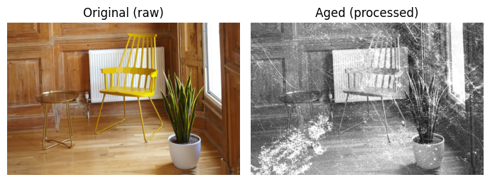
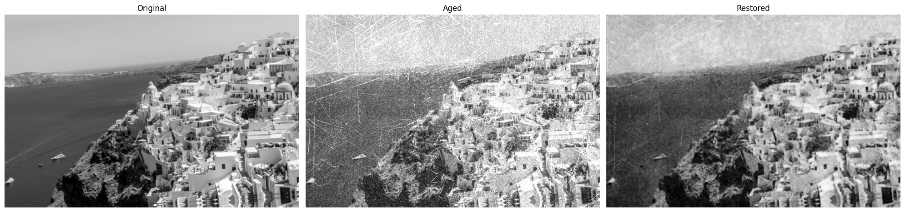

# image-restoration

## Assignment 1

Project of the course *Applied Deep Learning*

- Topic: Restoring grainy black and white images, which actually consists of two potentially separate tasks: denoising and colorization.
- Project type: a combination of "Bring your own data" and "Bring your own method".
- Inspiration: In 2018, Peter Jackson, the director of The Lord of the Ring movies, released a new movie called "They Shall Not Grow Old". He took old, grainy, black and white footages of the first world war, denoised them, colored them, added sound to them, and edited them into a whole movie that tells a story. The result was stunning. We always think of older historical events as black and white, as grainy. We have only seen low quality footage. But those people did not live in a black and white world. Their world had as much color as we have now. This alone makes a huge difference in immersing the audience into the story.
- Approach: I intend to synthesize my own data. The [DIV2K dataset](https://paperswithcode.com/dataset/div2k) can be used as the dataset. It has 1000 images. Then, I would have to synthesize black and white grainy images from them. Then, I would like to try using convolutional autoencoders to denoise the images. Then, I would like to try using a UNet for colorization. It would also be interesting to try an end-to-end approach to combine both tasks into one.
- Papers:
  
   https://paperswithcode.com/paper/image-restoration-using-convolutional-auto
  
   https://paperswithcode.com/paper/colorful-image-colorization
- Time estimation:
1. dataset synthesis and augmentation: 30 hrs
2. denoising model: 15 hrs
3. colorization model: 15 hrs
4. fine-tuning everything: 5 hrs
5. final report and presentation: 10 hrs


## Assignment 2

### 1. Installation
Clone the repository.
Then, create a virtual env:

```bash
python3 -m venv venv
source venv/bin/activate
```

All dependencies are listed in `setup.py`.
Therefore, simply install the project by only running:
```bash
pip install .
```
in the root of the repository.

### 2. Dataset collection and preprocessing
The main dataset for this project is DIV2K.
It contains 1000 high resolution images, mainly designed for tasks regarding super resolution and reconstruction.

Furthermore, since there are no datasets available for old images, we have to simulate our own.
For this, I perform three operations in our dataest:
1. Make images black and white
2. Add Gaussian noise to simulate the grain in old photos
3. Last but certainly not least, overlay textures of dirt to simulate the wear and tear of old photos

Here are a few of the textures that were overlayed:


And here are some samples of the photos I simulated using this technique:




### 3. Model selection
Our goal is to restore old photos that have been damaged and worn out over time.
I did a lot of reseach and finally landed on UNets as the model.
UNets are a great choice for all tasks where the output is another image, e.g. image segmentation.
Furthermore, UNets have proven themselves in image reconstruction, super resolution, and colorization tasks.

For implementation, check out `src/model.py`.

I used Keras to implement the main pipelines.

### 5. Instructions
Either run the files in the scripts folder, or follow along with the jupyter notebooks.
Both perform the exact same code.
Though, of course, the notebooks are preferred for conducting experiments as they are interactive.

First, the data has to be downloaded from Google Drive and extracted to the `data` folder.

Then, the training script can be executed.

### 6. Results
Using the early stopping technique, the model stopped training after 20 epochs.
Here are some results:





We can see that the model can take care of local noise, however, it struggles with completing large patches (scratches) that are wiped out.
The model works well as a denoiser, however, it struggles with image in-painting.
