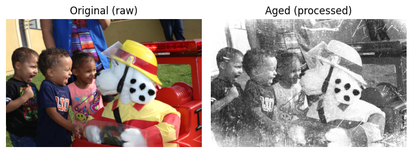
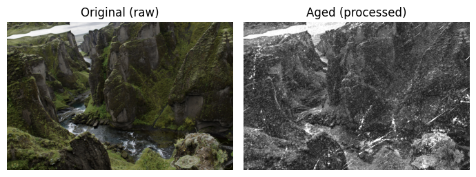
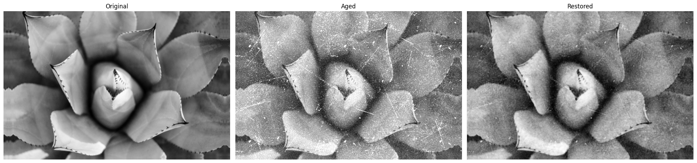
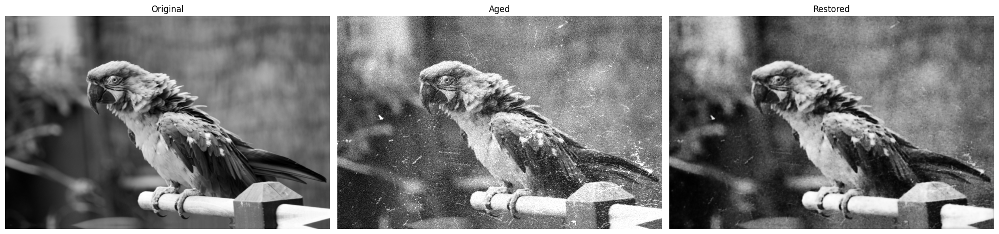

# image-restoration

In this project, I implemented a deep learning algorithm to restore grainy black and white photos. This includes solving two (potentially separate) tasks: image denoising and image colorization.

Furthermore, I intend to simulate my own dataset of old aged photos by simulating wear-and-tear effects on new photos.

Demo Application: https://huggingface.co/spaces/arianetemadi/image-restoration

- Inspiration: In 2018, Peter Jackson, the director of The Lord of the Ring movies, released a new movie called "They Shall Not Grow Old". He took old, grainy, black and white footages of the first world war, denoised them, colored them, added sound to them, and edited them into a whole movie that tells a story. The result was stunning. We always think of older historical events as black and white, as grainy. We have only seen low quality footage. But those people did not live in a black and white world. Their world had as much color as we have now. This alone makes a huge difference in immersing the audience into the story.

### 1. Installation
After cloning the repository, create a virtual environment by running
```bash
python3 -m venv venv
source venv/bin/activate
```

Then, since all dependencies are listed in `setup.py`, the project can simply be installed by running
```bash
pip install -e .
```
at the root of the cloned repository.

### 2. Instructions for execution
First, the data has to be downloaded from Google Drive and extracted to the `data` folder, by running `notebooks/download_data.ipynb` or `scripts/download_data.ipynb`.

Then, the model can be trained via `notebooks/train.ipynb` or `scripts/train.py`.

Finally, the model can be tested via `notebooks/predict.ipynb`.
Pretrained weights are also available (in `checkpoints`).

### 3. Report

#### 3.1. Dataset
The [DIV2K](https://data.vision.ee.ethz.ch/cvl/DIV2K/) dataset is used as the source for our unprocessed photos.
It contains 1000 high-resolution photos divided into: 800 photos for training, 100 photos for validation, and 100 photos for testing.

First, we have to simulate the appearance of old grainy photos with visible wear and tear.
To this end, I perform three operations in this order:
1. Transform the photo to grayscale
2. Add Gaussian noise to simulate the grain
3. Most importantly, overlay specific textures to simulate the desired wear and tear.

I gathered textures that look like this (64 in total):


Here are some of the results of the simulated "aged" photos using this technique:







All of these transformations are implemented like an image augmentation.
Therefore, nothing is saved explicitly.
Transformations are applied randomly on the fly.

#### 3.2. Model
After a lot of research, I landed on UNets as the model for this task.
UNets have proven themselves in tasks regarding image reconstruction.
This is how the architecture looks in general:


After trial and error, I ended up using a smaller version.
For details, please check out `src/model.py`.

#### 3.3. Implementation details
Some techniques I used:
- Early stopping
- Learning rate scheduling
- Spatial and pixel-wise image augmentations

The pipeline can work in two color modes: `rgb` and `grayscale`.
The difference is that in `rgb` the task is harder: we also need to colorize the image.

#### 3.4. Error metric
Besides qualitative evaluation by looking at the restored photos in the test set, I specified the Mean Squared Error (MSE) as the error metric, to compare the original and restored photos.
MSE is also the loss function that the model attempts to minimize.
Assuming we require any pixel of the restored photo to be within %1 of the corresponding pixel in the original image, I calculated a value of `0.0001` as the target MSE.
MSE after the first epoch becomes `0.186` and the model output already resembles the input a lot (without much denoising/in-painting), and it finally reaches its best of `0.008` after 16 epochs before overfitting.
My initial aim was much lower.

#### 3.4. Results
After training the `grayscale` model for 36 epochs, here are a few test results of the epoch with the lowest validation loss.






It can be seen that the model is great at taking care of noise and small scratches.
On the other hand, the model struggles with larger wear and tear that require image in-painting for restoration, which is of course more difficult as the model needs to gain a much deeper, more global, more contextual understanding of the dataset.

As for the colorization, the `rgb` version of the pipeline does not work at all and fails to understand colors (after 20 epochs):


I also tried converting images to the LAB space, and using a model to predict only the A and B channels.
The L channel is only the brightness.
Therefore, assuming the noise and wear and tear are restored, we can directly put the input image into channel L, and only predict A and B to colorize the photo. This should make it easier for our model to predict, as it would only have to get 2 channels right, as opposed to 3 channels in rgb.
However, I did not see any qualitative improvement in results.

#### 3.5 Time breakdown
1. Dataset synthesis and augmentation: 5 hrs, which was much faster than I expected since the idea of overlaying dirt textures worked out pretty well. The simulated photos look realistic.
2. Models took most of the time by far: about 40 hrs, which was more than I expected. Choosing a suitable approach to implementation and establishing a working pipeline took longer than I expected. Development was also made more difficult because of the difficulties with development in Colab. Initially, I was developing completely in Colab before committing to any approach.
3. Fine-tuning the grayscale model did not take much time, but I spent about 5 hrs fine-tuning the rgb model which did not work out in the end.
4. Writing the report and documentation for the code took about 4 hrs.
